<div align="center">
  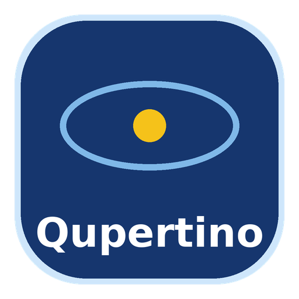
  <h1>osxQ / QuantumStudio</h1>
  <p><b>Apple Silicon quantum benchmarking stack</b> with a local simulator, reproducible benchmark pipelines, and a desktop UI.</p>
</div>

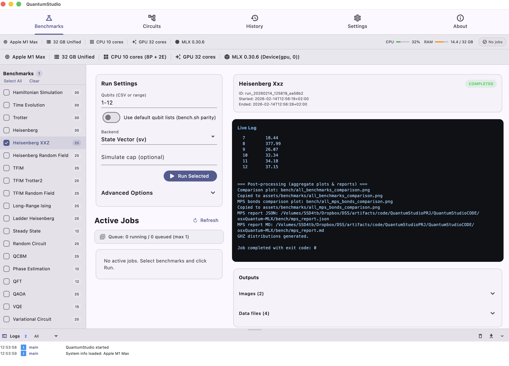

osxQuantum is a three-part project: a self-published technical report, the osxQ simulator stack, and the dedicated QuantumStudio desktop UI studio. There is no native MLX quantum simulator available today, so osxQ provides a local simulator layer for QFT, QAOA, VQE, Hamiltonian workflows, and OpenQASM runs.

- Website: https://boltzmannentropy.github.io/osxQuantumWEB/
- Repository: https://github.com/BoltzmannEntropy/osxQ
- Author: **Shlomo Kashani**
- Technical report: unpublished; PDF and LaTeX source are kept locally and are not distributed in this repository.

## How to Cite

### Repository (Git / Software Citation)

```bibtex
@software{kashani_osxq_2026,
  author       = {Shlomo Kashani},
  title        = {osxQ / QuantumStudio: Apple Silicon Quantum Benchmarking Stack},
  year         = {2026},
  url          = {https://github.com/BoltzmannEntropy/osxQ},
  note         = {GitHub repository}
}
```

### Technical Report Citation

```bibtex
@techreport{kashani_mlxq_2026,
  author       = {Shlomo Kashani},
  title        = {mlxQ: Unified Memory Quantum Simulation on Apple Silicon via the MLX Framework},
  year         = {2026},
  institution  = {Self-published technical report (unpublished)},
  url          = {https://github.com/BoltzmannEntropy/osxQ}
}
```

## Extended Introduction

osxQ exists to make Apple Silicon quantum benchmarking practical, local-first, and reproducible. The project packages three layers into one workflow:

1. **Research layer**: benchmark methodology and framing (see the included technical report).
2. **Simulator layer (`mlxq`)**: state-vector and MPS backends on MLX for Apple Silicon.
3. **Product layer (`QuantumStudio`)**: desktop run orchestration, monitoring, and export.

The core motivation is straightforward: Apple Silicon uses a unified memory model, but there is no default native MLX quantum runtime shipped as a platform quantum simulator. osxQ fills that gap with a local simulator stack and benchmark harnesses for QFT, QAOA, VQE, QCBM, Grover, Hamiltonian/time-evolution workflows, and OpenQASM runs.

This repository is designed for publication-grade reproducibility:
- deterministic CLI run paths
- structured CSV/JSON output
- frozen artifact promotion under `assets/benchmarks-frozen/`
- UI+CLI parity for auditability

## Project Structure

- `src/` Python simulator + benchmark code (`mlxq`)
- `bench.sh` single/full benchmark launcher
- `bench_with_logging.sh` orchestrated benchmark runs with logging/promotions
- `bench/runs/` per-run outputs (`run_YYYYmmdd_HHMMSS`)
- `quantumstudio/` desktop UI + backend + control scripts
- `datasets/qasm/local/` OpenQASM local corpus
- `assets/benchmarks-frozen/` frozen benchmark artifacts and sample bundles

## Benchmark Context And Representative Results

Representative scaling points (Apple Silicon, report-aligned methodology):

- QFT @ 25q: ~7s scale
- QAOA @ 25q: ~11s scale
- Hamiltonian simulation @ 25q: ~40s scale
- Grover @ 25q: high-growth runtime regime

Use this repository’s frozen assets and run logs as the source of truth for exact run-by-run values.

## Installation (Full)

### 1) System prerequisites

- macOS 13.3+ recommended
- Apple Silicon (M1/M2/M3/M4)
- Python 3.10+ (3.11 tested heavily)
- Optional: Flutter SDK (for UI development builds)

### 2) Core Python environment

```bash
cd /Volumes/SSD4tb/Dropbox/DSS/artifacts/code/QuantumStudioPRJ/QuantumStudioCODE
python3 -m venv .venv
source .venv/bin/activate
pip install -U pip
pip install -e .
```

`pyproject.toml` includes core dependencies (`mlx`, `rich`, `numpy`) and optional groups.

### 3) Backend dependencies (QuantumStudio API)

```bash
pip install -r quantumstudio/backend/requirements.txt
```

### 4) Runtime path for local commands

```bash
export PYTHONPATH=src
```

### 5) Flutter UI dependencies (optional, for UI dev)

```bash
cd quantumstudio/flutter_app
flutter pub get
```

## Running Benchmarks

### Standard full-orchestrated run

```bash
cd /Volumes/SSD4tb/Dropbox/DSS/artifacts/code/QuantumStudioPRJ/QuantumStudioCODE
./bench_with_logging.sh
```

### 12-qubit smoke test (recommended health check)

```bash
cd /Volumes/SSD4tb/Dropbox/DSS/artifacts/code/QuantumStudioPRJ/QuantumStudioCODE
PYTHON_BIN=/Users/sol/.pyenv/shims/python3 ./bench_with_logging.sh --frozen-parity-12
```

### Single-circuit run example

```bash
PYTHON_BIN=/Users/sol/.pyenv/shims/python3 ./bench.sh --circuit variational_circuit --simulate-limit 12 --qubits 1,2,5,7,10,11,12
```

## Benchmark Catalog (Detailed)

The benchmark engine accepts the following circuit keys. For each benchmark below:
- Use the single-circuit form:
  - `./bench.sh --circuit <key> --simulate-limit <N> --qubits 1,2,5,7,10,11,12`
- Or run coordinated suites with:
  - `./bench_with_logging.sh --frozen-parity-12`

### 1) `hamiltonian_simulation`
- Purpose: product-formula simulation of spin Hamiltonians.
- Typical command:
```bash
./bench.sh --circuit hamiltonian_simulation --simulate-limit 12 --qubits 1,2,5,7,10,11,12
```

### 2) `time_evolution`
- Purpose: time-evolution scaling over qubit count.
- Typical command:
```bash
./bench.sh --circuit time_evolution --simulate-limit 12 --qubits 1,2,5,7,10,11,12
```

### 3) `trotter`
- Purpose: Trotterized evolution workload for depth/runtime growth.
- Typical command:
```bash
./bench.sh --circuit trotter --simulate-limit 12 --qubits 1,2,5,7,10,11,12
```

### 4) `steady_state`
- Purpose: heavier iterative dynamics workload; often the slowest leg.
- Typical command:
```bash
./bench.sh --circuit steady_state --simulate-limit 12 --qubits 1,2,5,7,10,11,12
```

### 5) `heisenberg`
- Purpose: baseline Heisenberg model scaling.
- Typical command:
```bash
./bench.sh --circuit heisenberg --simulate-limit 12 --qubits 1,2,5,7,10,11,12
```

### 6) `heisenberg_xxz`
- Purpose: anisotropic XXZ Heisenberg variant.
- Typical command:
```bash
./bench.sh --circuit heisenberg_xxz --simulate-limit 12 --qubits 1,2,5,7,10,11,12
```

### 7) `heisenberg_random_field`
- Purpose: disordered Heisenberg workload with random field terms.
- Typical command:
```bash
./bench.sh --circuit heisenberg_random_field --simulate-limit 12 --qubits 1,2,5,7,10,11,12
```

### 8) `tfim`
- Purpose: transverse-field Ising model baseline.
- Typical command:
```bash
./bench.sh --circuit tfim --simulate-limit 12 --qubits 1,2,5,7,10,11,12
```

### 9) `tfim_trotter2`
- Purpose: second-order Trotter TFIM variant.
- Typical command:
```bash
./bench.sh --circuit tfim_trotter2 --simulate-limit 12 --qubits 1,2,5,7,10,11,12
```

### 10) `tfim_random_field`
- Purpose: TFIM with random field perturbations.
- Typical command:
```bash
./bench.sh --circuit tfim_random_field --simulate-limit 12 --qubits 1,2,5,7,10,11,12
```

### 11) `long_range_ising`
- Purpose: long-range interaction Ising scaling.
- Typical command:
```bash
./bench.sh --circuit long_range_ising --simulate-limit 12 --qubits 1,2,5,7,10,11,12
```

### 12) `ladder_heisenberg`
- Purpose: ladder-geometry Heisenberg workload.
- Typical command:
```bash
./bench.sh --circuit ladder_heisenberg --simulate-limit 12 --qubits 1,2,5,7,10,11,12
```

### 13) `random_circuit`
- Purpose: generic random gate-circuit scaling.
- Typical command:
```bash
./bench.sh --circuit random_circuit --simulate-limit 12 --qubits 1,2,5,7,10,11,12
```

### 14) `qcbm`
- Purpose: Quantum Circuit Born Machine benchmark family.
- Typical command:
```bash
./bench.sh --circuit qcbm --simulate-limit 12 --qubits 1,2,5,7,10,11,12
```

### 15) `phase_estimation`
- Purpose: phase estimation runtime growth.
- Typical command:
```bash
./bench.sh --circuit phase_estimation --simulate-limit 12 --qubits 1,2,5,7,10,11,12
```

### 16) `qft`
- Purpose: Quantum Fourier Transform scaling.
- Typical command:
```bash
./bench.sh --circuit qft --simulate-limit 12 --qubits 1,2,5,7,10,11,12
```

### 17) `qaoa`
- Purpose: QAOA-style variational optimization workload.
- Typical command:
```bash
./bench.sh --circuit qaoa --simulate-limit 12 --qubits 1,2,5,7,10,11,12
```

### 18) `vqe`
- Purpose: VQE-style variational eigensolver workload.
- Typical command:
```bash
./bench.sh --circuit vqe --simulate-limit 12 --qubits 1,2,5,7,10,11,12
```

### 19) `variational_circuit`
- Purpose: generic parameterized variational circuit benchmark.
- Typical command:
```bash
./bench.sh --circuit variational_circuit --simulate-limit 12 --qubits 1,2,5,7,10,11,12
```

### 20) `grover`
- Purpose: Grover-style amplitude amplification benchmark.
- Typical command:
```bash
./bench.sh --circuit grover --simulate-limit 12 --qubits 1,2,5,7,10,11,12
```

### 21) `ghz`
- Purpose: GHZ state generation and scaling.
- Typical command:
```bash
./bench.sh --circuit ghz --simulate-limit 12 --qubits 1,2,5,7,10,11,12
```

### QASM Suite
- Purpose: OpenQASM corpus execution from `datasets/qasm/local/`.
- Typical command:
```bash
./bench.sh --qasm-suite --qasm-max-qubits 18 --qasm-timeout-ms 30000
```

## Example & Circuit Gallery

osxQ ships a broad gallery of runnable examples: **21 parameterized benchmark families** (any qubit count) plus a **42-circuit OpenQASM corpus** under `datasets/qasm/local/`. Run any benchmark family with `./bench.sh --circuit <key>`; run any QASM circuit through the QASM suite. The full gallery is also published on the [website](https://boltzmannentropy.github.io/osxQuantumWEB/#gallery).

### A. Parameterized benchmark families (`--circuit <key>`)

| Category | Circuit keys |
| --- | --- |
| Spin & Hamiltonian dynamics | `hamiltonian_simulation`, `time_evolution`, `trotter`, `steady_state`, `heisenberg`, `heisenberg_xxz`, `heisenberg_random_field`, `tfim`, `tfim_trotter2`, `tfim_random_field`, `long_range_ising`, `ladder_heisenberg` |
| Variational & QML | `qcbm`, `qaoa`, `vqe`, `variational_circuit` |
| Core algorithms | `qft`, `phase_estimation`, `grover`, `ghz`, `random_circuit` |

### B. OpenQASM corpus (`datasets/qasm/local/`, 42 circuits)

| Category | Circuit (qubits) |
| --- | --- |
| States & entanglement | `bell` (2), `bell_state` (2), `bell_n4` (4), `ghz_state_n23` (23), `cat_state_n22` (22), `wstate_n3` (3), `wstate_n27` (27), `coin_flip` (1), `qrng_n4` (4) |
| Textbook algorithms | `deutsch_n2` (2), `grover_n2` (2), `grover_2qubit` (2), `qft_n4` (4), `qft_n18` (18), `inverseqft_n4` (4), `qpe_n9` (9), `ipea_n2` (2), `swap_test_n25` (25), `toffoli_n3` (3), `teleport_minimal` (3), `teleportation_n3` (3), `bv_n14` — Bernstein–Vazirani (14), `hs4_n4` — hidden shift (4), `bwt_n21` — binary welded tree (21) |
| Arithmetic & factoring | `bigadder_n18` (18), `multiplier_n15` (15), `multiply_n13` (13), `qf21_n15` — factor 21 (15), `factor247_n15` — factor 247 (15) |
| Variational & physics | `vqe_n4` (4), `vqe_n24` (24), `vqe_ising`, `variational_n4` (4), `ising_n10` (10), `ising_n26` (26) |
| Applied, ML & QEC | `dnn_n16` — quantum DNN (16), `knn_n25` — quantum kNN (25), `sat_n11` — SAT (11), `seca_n11` (11), `qram_n20` — QRAM (20), `qec9xz_n17` — Shor [[9,1,3]] code (17), `advanced_circuit` |

Run a QASM circuit:
```bash
./bench.sh --qasm-suite --qasm-max-qubits 27 --qasm-timeout-ms 30000
```

## Full Example Catalog (250+)

Beyond the circuit gallery above, osxQ ships **250 runnable example functions** — gate-algebra
identities, state preparation, algorithm demonstrations (Bell, GHZ, QFT, Grover, Toffoli,
teleportation, QPE), MPS tensor-network parity, OpenQASM execution, and the QuantumStudio
backend/MCP API. The complete itemized list is published on the
[Examples & Catalog page](https://boltzmannentropy.github.io/osxQuantumWEB/examples.html).

| Category | Count | Source |
| --- | ---: | --- |
| Core simulator & gate algebra | 149 | `src/tests/mlxQCoreTest.py` |
| Quantum-computing examples (identities, algorithms) | 41 | `src/tests/mlxQQCExamplesTest.py` |
| Internal consistency & measurement parity | 21 | `src/tests/mlxQInternalConsistencyTest.py`, `mlxQMeasurementParityTest.py` |
| MPS tensor-network backend | 12 | `src/tests/mlxQMpsBackendTest.py`, `mlxQMpsParamSuiteTest.py` |
| QML wrapper | 5 | `src/tests/mlxQQmlWrapperTest.py` |
| QPE energy estimation | 2 | `src/tests/mlxQQpeEnergyEstimationTest.py` |
| Benchmark catalog & visualization | 3 | `src/tests/mlxQBenchCatalogTest.py`, `mlxQVisualizationPlotsTest.py` |
| QuantumStudio backend API & MCP server | 17 | `quantumstudio/tests/test_backend_api.py`, `test_mcp_server.py` |
| **Total** | **250** | |

Run them all with `./test.sh`, or one module with `python3 -m pytest <file> -q`.

## Sample Benchmark Log (12q Smoke)

```text
[preflight] MLX initialization OK
=== Single-circuit run: variational_circuit (qubits: 1,2,5,7,10,11,12, cap: 12) ===
=== Running variational_circuit (qubits: 1,2,5,7,10,11,12, cap: 12) ===
variational_circuit Scaling Benchmark
Framework: mlx–quantum | Device: apple–silicon–mlx | Backend: mps
Testing qubit counts: 1, 2, 5, 7, 10, 11, 12
variational_circuit    |  1q | gates     8 | wall    3.86 ms
variational_circuit    |  2q | gates    20 | wall   17.51 ms
variational_circuit    |  5q | gates    56 | wall   12.41 ms
variational_circuit    |  7q | gates    80 | wall   16.65 ms
variational_circuit    | 10q | gates   116 | wall   18.76 ms
variational_circuit    | 11q | gates   128 | wall   51.75 ms
variational_circuit    | 12q | gates   140 | wall   38.91 ms
```

## Frozen Assets And Sample Bundles

`assets/benchmarks-frozen/` is the reproducibility backbone:

- `latest/` = current promoted benchmark plots
- `sample-runs/legacy_25q_logs_2025-10/` = curated historical 24/25q logs
- `sample-runs/legacy_dmg_stage_bench_snapshot/` = legacy full snapshot (images/csv/json/logs)
- `sample-runs/legacy_25q_plus_smoke12/` = combined large-qubit + modern 12q smoke artifacts

Recommended workflow:

1. Run benchmarks (`bench.sh` / `bench_with_logging.sh`).
2. Validate data in `bench/runs/<run_id>/`.
3. Promote validated outputs to `assets/benchmarks-frozen/latest/`.
4. Keep historical reference bundles immutable under `sample-runs/`.

## Testing (200+ Coverage)

The repository includes broad simulator, algorithm, and backend tests:
- `src/tests/` + `quantumstudio/tests/` currently expose **233+ test functions**.
- Raw assertion density across test code is **well above 200 checks** (500+ assert-related lines).
- Coverage includes:
  - gate algebra and unitary identities
  - state preparation and measurement parity
  - QFT/QAOA/VQE/QCBM/Grover behavior checks
  - MPS backend parity and bond-growth diagnostics
  - OpenQASM parser/execution checks
  - QuantumStudio backend API tests

Run tests:
```bash
./test.sh
```

Targeted suites:
```bash
python3 -m pytest src/tests -q
python3 -m pytest quantumstudio/tests -q
```

## QuantumStudio UI

Start/stop the desktop stack:

```bash
cd quantumstudio
./bin/appctl up
./bin/appctl status
./bin/appctl logs backend
./bin/appctl down
```

Build UI artifacts:

```bash
./scripts/build_flutter_app.sh --release
./scripts/build_dmg.sh
```

## Screenshots

### Product UI

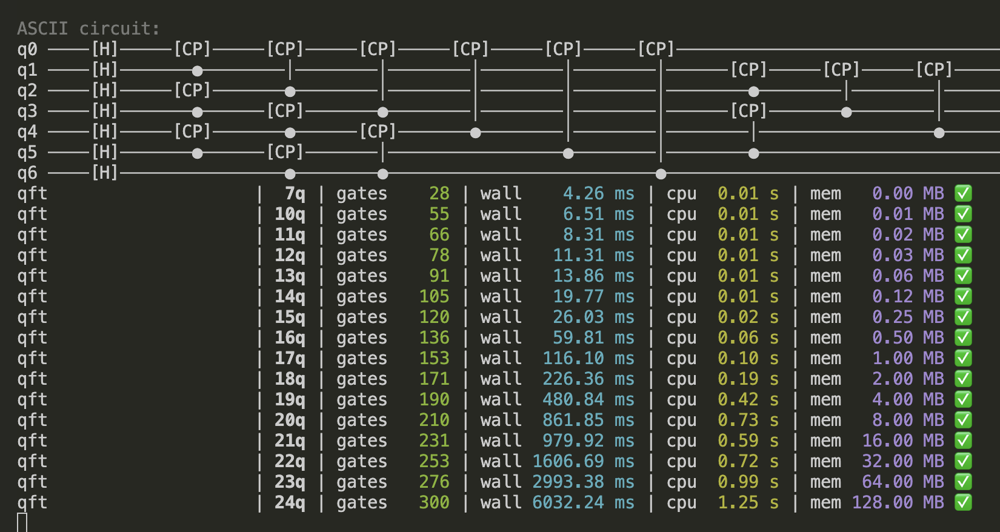
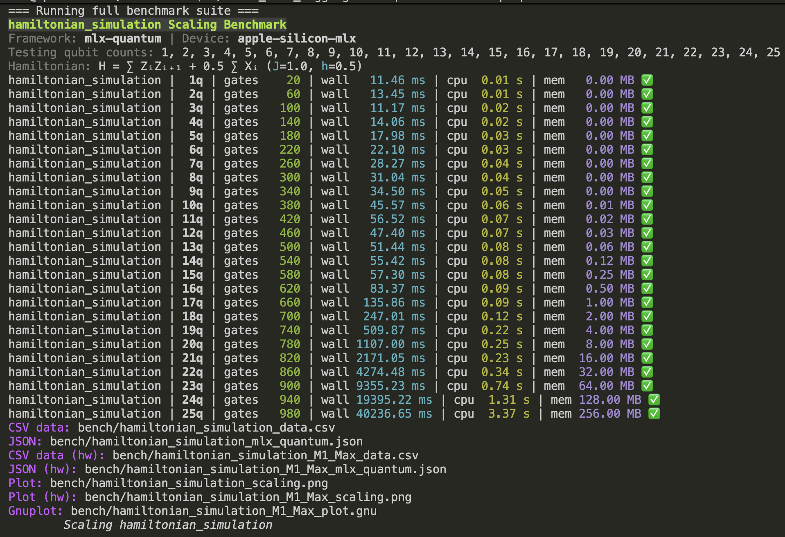

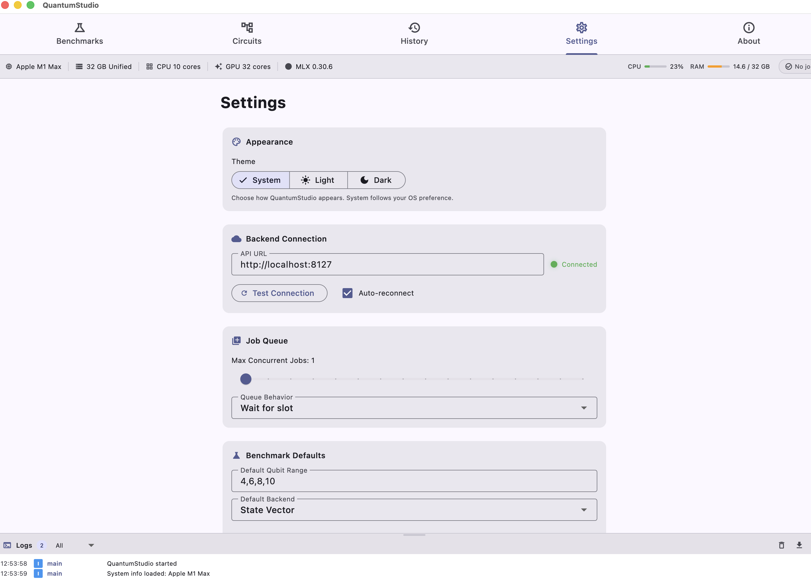
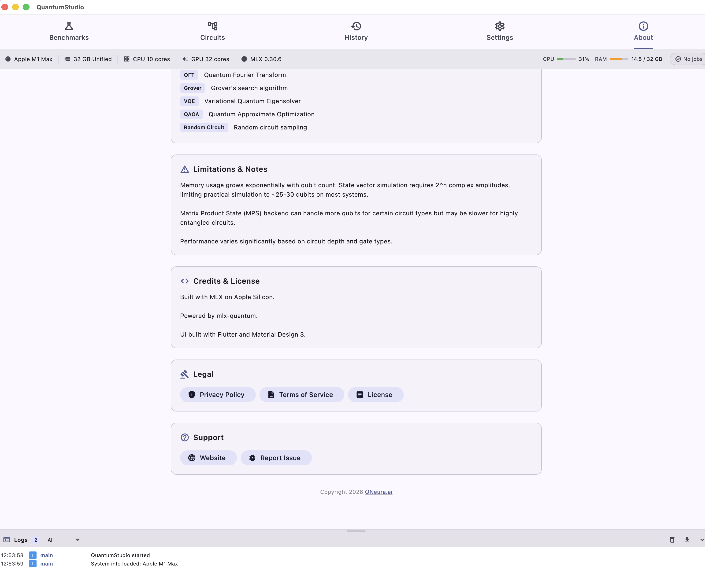

### Benchmark Figures (Paper Workflow)

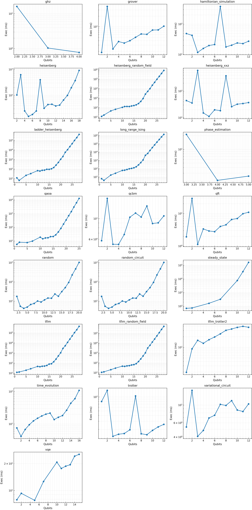
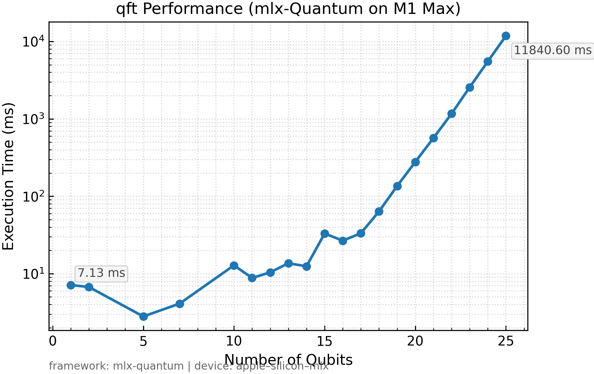
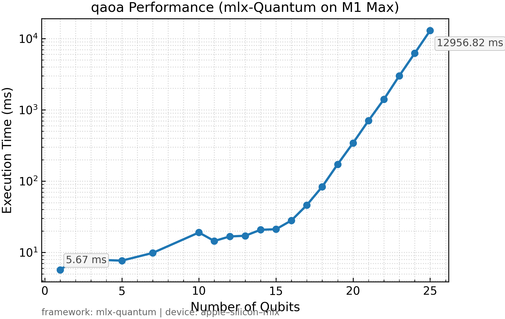
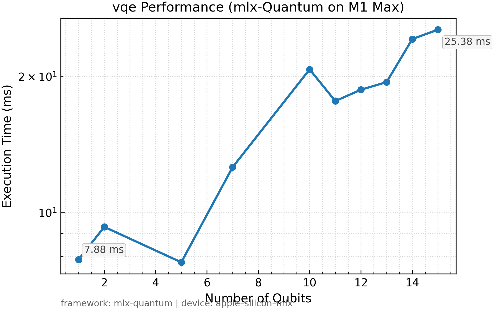
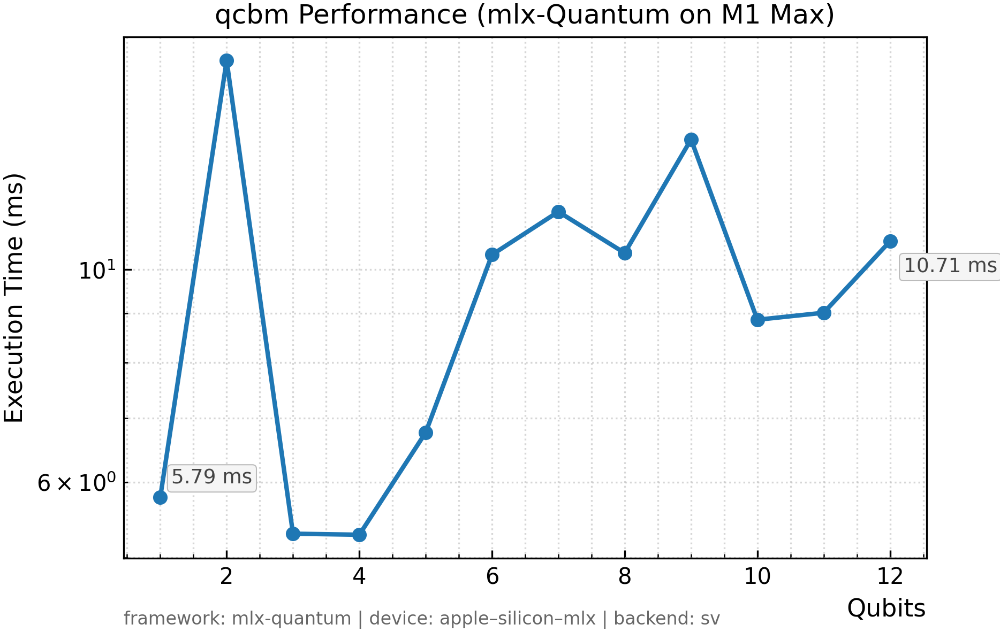
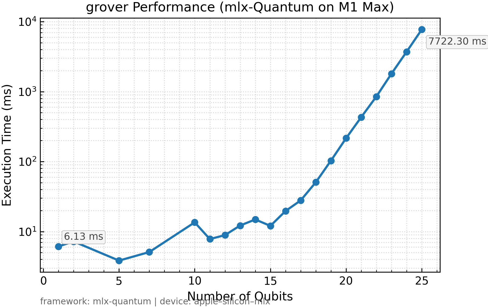
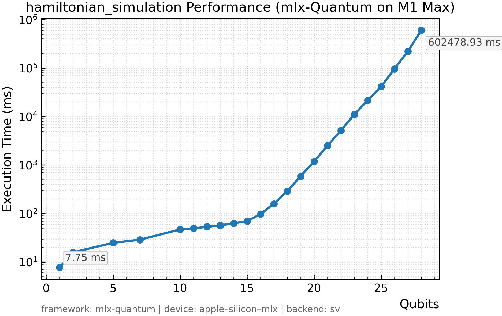

## Licensing

osxQ / QuantumStudio is free and open source under the **MIT License** (see [`LICENSE`](LICENSE)). The source code and the compiled macOS binaries are both covered by the same MIT terms — use, modify, and redistribute freely, including for commercial purposes. No purchase or license key is required.

## Notes

- This repo is local-first by design: benchmark execution and artifacts remain on-device.
- For web-facing product copy, see `https://boltzmannentropy.github.io/osxQuantumWEB/`.
