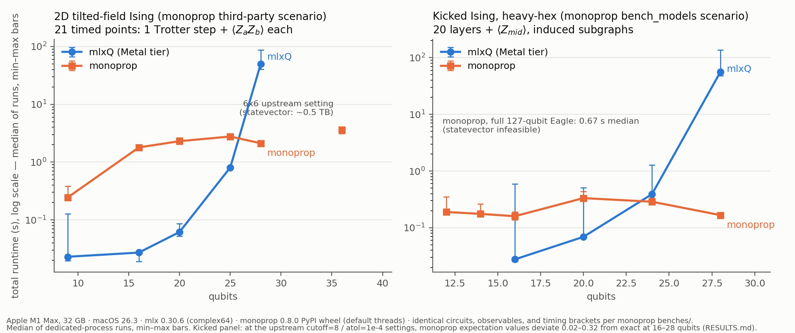

# mlxQ (Qupertino) vs monoprop — independent re-run of monoprop's benchmark scenarios on Apple Silicon

An independent re-implementation of the benchmark scenarios published in
[Algorithmiq's monoprop](https://github.com/algorithmiq/monoprop) (`benches/`),
run head-to-head against **mlxQ**, this repository's MLX-based statevector
simulator with hand-tuned Metal kernels. Both engines execute the *same*
circuits, angles, observables, and timing brackets; monoprop is driven through
its published Python API (PyPI wheel 0.8.0) with its upstream truncation
settings.



Full number tables: [RESULTS.md](RESULTS.md). Raw per-step series:
`results/raw/*.jsonl`. Benchmark source:
[`src/benchmark/bench_monoprop_tfim.py`](../../src/benchmark/bench_monoprop_tfim.py).

## Environment

| | |
|---|---|
| Machine | Apple M1 Max, 32 GB unified memory |
| OS | macOS 26.3 |
| Python | 3.11.3 |
| mlx | 0.30.6 (statevector in complex64) |
| monoprop | 0.8.0 (`pip install monoprop`, cp311 macosx_15_0_arm64 wheel), default thread settings |

Single process, no other load; engines run sequentially, never concurrently.

## Scenarios (mirrored from monoprop `benches/`)

**2D tilted-field Ising** (`benches/third_party/pauli_prop`): Trotterized TFIM
on an nx x ny grid, hx = hz = 1.0, J = 1.5, dt = 0.05; per Trotter step all
RZZ bonds, then RZ, then RX; observable ZZ on the central horizontal bond;
initial state |0...0>. 21 timed points, each = one application of the step
circuit + the expectation value, timer bracketing both (upstream `_run_steps`
semantics). monoprop settings as committed upstream: `lower_atol=1e-6`, no
weight cutoff. Upstream pins 6x6 (36 qubits); a 36-qubit statevector is
~0.5 TB, so the head-to-head sweeps grids both engines can hold and the 6x6
point is reported for monoprop alone.

**Kicked Ising** (`benches/bench_models.py`): RX and RZZ layers on the IBM
Eagle 127-qubit heavy-hex coupling map, 20 layers, theta = coupling = pi/4,
observable Z on the central qubit, `cutoff=8`, `lower_atol=1e-4`. One timed
run = full propagation + expectation. Reduced sizes use the induced subgraph
on the first n qubits; the full 127-qubit configuration is reported for
monoprop alone.

The two fermionic (Majorana/Fermi–Hubbard) scenarios are not re-implemented —
they would need a Jordan–Wigner layer on the statevector side to be
comparable.

## Correctness gate

`bench_monoprop_tfim.py check` cross-validates the two engines with
truncation effectively off (`lower_atol=1e-14`, no weight cutoff)
before any timing is trusted ([results/check.txt](results/check.txt)):

```
TFIM 3x3: max |mlxQ - monoprop| = 3.16e-06  [OK]
TFIM 3x4: max |mlxQ - monoprop| = 2.45e-06  [OK]
Kicked n=10: |mlxQ - monoprop| = 3.35e-06  [OK]
```

Residual drift is the mlxQ side's complex64 precision.

**Convention note for the monoprop authors.** We observed that the `ExpGate`
parameter p acts as exp(-i·p·P): back-propagating Z through an X gate with
parameter p returns cos(2p) (measured cos(1.4) = 0.16997 for p = 0.7). The
README quick-example comments suggest exp(-i·theta/2 ·), which would predict
cos(p). Not a correctness issue — the library is self-consistent and
`from_qiskit_circuit` presumably converts — but the native-API docs cost us a
debugging cycle; a clarifying line in the docstring would help independent
users. Qiskit-convention angles theta map to monoprop parameters theta/2.

## Findings

1. **Complementary regimes, crossover at ~24–28 qubits.** By median over
   dedicated-process repeats, mlxQ (Metal tier) leads by up to 66x in the
   16–20-qubit range and by 3.4x at the 25-qubit TFIM; the 24-qubit kicked
   point is a near-tie (monoprop 1.4x ahead), and from 28 qubits monoprop
   leads decisively (23.5x TFIM, ~340x kicked) and alone reaches the
   36-qubit TFIM (3.6 s) and 127-qubit kicked Ising (0.67 s, 223k terms).
   The crossover is algorithmic (2^n state growth vs saturating term counts:
   ~3.6–5.6M for TFIM), not an implementation artifact.

2. **Accuracy at production truncation.** At the upstream kicked-Ising
   settings (`cutoff=8`, `lower_atol=1e-4`) monoprop's expectation values on
   the 16–28-qubit induced subgraphs deviate from the exact statevector
   values by 0.02–0.32 absolute (at n=28: +0.0004 vs exact +0.2906). On
   dense subgraphs a weight-8 cutoff is only mildly truncating in principle
   but strongly truncating in effect; at the full 127-qubit topology, where
   light cones keep operator support small, the setting is presumably far
   more accurate. Worth noting when quoting reduced-size speedups.

3. **Statevector memory ceiling.** At >= 26 qubits the mlxQ side needed a
   per-step MLX buffer-pool flush (`mx.clear_cache()`) to avoid unified-memory
   thrashing (262 s -> 41 s at 28 qubits); 28 qubits is the practical ceiling
   on 32 GB. Even with the flush, 28-qubit runs vary 2–3x run to run
   (TFIM 40.7–86.6 s; kicked 47.8–135.9 s) — the min–max bars in the figure
   show this. The flush is part of the committed benchmark.

4. **Measurement protocol matters at these timescales.** Two effects the
   initial single-shot runs hid: (a) sub-second monoprop times vary
   +-20–50% between runs, and (b) running monoprop after mlxQ in the same
   process inflated monoprop's 28-qubit TFIM time by ~38% (2.93 s shared vs
   2.02–2.23 s dedicated) through residual memory pressure. All reported
   numbers are therefore medians over repeats in dedicated per-engine
   processes; the contaminated and pre-fix raw runs are retained in
   `results/raw/` and excluded by the documented rules in `make_figure.py`.

## Fairness caveats

- mlxQ computes in complex64; monoprop in double precision. This favors mlxQ
  on memory and bandwidth and costs it ~1e-6 accuracy (see check gate).
- monoprop runs with its default (multi-)threading on the M1 Max's CPU cores;
  mlxQ uses the GPU. This is a whole-machine, engine-vs-engine comparison,
  not a core-for-core one.
- The first Metal-tier point of a process includes one-time kernel
  compilation (visible at the 9-qubit TFIM point: 0.127 s vs 0.020 s for the
  pure-MLX tier).
- In the TFIM runner the all-qubit RZ layer's diagonal phase vector is built
  once *outside* the timed region (setup, like monoprop's propagator
  construction), whereas the pure-MLX tier's fused ZZ-layer cache builds
  inside the first timed step. Both are one-time O(n·2^n) costs; moving the
  Z-layer build inside the first step would raise only that step.
- Single machine. Unlike upstream's rounds=1/iterations=1, each point is the
  median of >= 3 dedicated-process runs with min–max spread reported —
  single-shot times proved too noisy (+-20–50%) to support ratio claims.
  Raw per-step series for every run, including excluded ones, are committed.

## Reproduce

```bash
.runtime-venv/bin/python -m pip install monoprop
PYTHONPATH=src .runtime-venv/bin/python -u src/benchmark/bench_monoprop_tfim.py check
MLXQ_METAL_KERNELS=1 PYTHONPATH=src .runtime-venv/bin/python -u src/benchmark/bench_monoprop_tfim.py tfim --sizes 3x3,4x4,4x5,5x5,4x7
PYTHONPATH=src .runtime-venv/bin/python -u src/benchmark/bench_monoprop_tfim.py tfim --sizes 6x6 --backends monoprop
MLXQ_METAL_KERNELS=1 PYTHONPATH=src .runtime-venv/bin/python -u src/benchmark/bench_monoprop_tfim.py kicked --qubits 16,20,24,28
PYTHONPATH=src .runtime-venv/bin/python -u src/benchmark/bench_monoprop_tfim.py kicked --qubits 127 --backends monoprop
.runtime-venv/bin/python bench/monoprop_compare/make_figure.py
```

Results land in `bench/monoprop_compare/` as timestamped JSONL;
`make_figure.py` regenerates the figure and tables from `results/raw/`.
